# Architecture Documentation

This document provides a comprehensive overview of the SaaS Go App architecture, with a focus on the leader/follower database pattern implementation.

## Table of Contents

1. [System Overview](#system-overview)
2. [Architecture Components](#architecture-components)
3. [Leader/Follower Database Pattern](#leaderfollower-database-pattern)
4. [Data Flow](#data-flow)
5. [Request Routing](#request-routing)
6. [Database Connection Management](#database-connection-management)
7. [Background Jobs](#background-jobs)
8. [Authentication & Authorization](#authentication--authorization)
9. [Deployment Architecture](#deployment-architecture)

---

## System Overview

The SaaS Go App is a full-stack web application built with:
- **Backend**: Go (Golang) with Gin web framework
- **Frontend**: Vue.js 3 with Bootstrap 5
- **Primary Database**: PostgreSQL (Heroku Postgres)
- **Analytics Database**: PostgreSQL Follower Pool (optional)
- **Job Queue**: Redis with Asynq (optional)
- **Monitoring**: Prometheus metrics
- **Documentation**: Swagger/OpenAPI

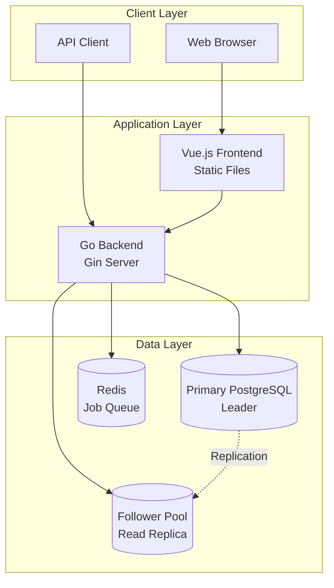

---

## Architecture Components

### Component Diagram

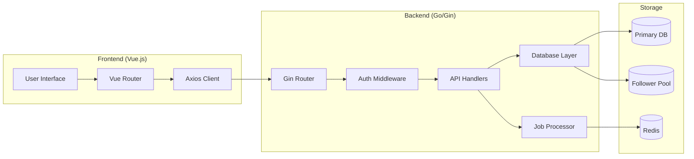

### Key Components

#### 1. **Frontend (Vue.js)**
- **Location**: `web/frontend/`
- **Purpose**: Single Page Application (SPA) for user interaction
- **Features**:
  - Dashboard with analytics visualization
  - Customer and Account management UI
  - JWT token-based authentication
  - Responsive Bootstrap styling

#### 2. **Backend API (Go/Gin)**
- **Location**: `main.go`, `internal/api/`
- **Purpose**: RESTful API server
- **Features**:
  - JWT authentication
  - CRUD operations for customers and accounts
  - Analytics endpoints
  - Health checks and metrics
  - Swagger documentation

#### 3. **Database Layer**
- **Location**: `internal/db/`
- **Purpose**: Database connection and query management
- **Components**:
  - `PrimaryDB`: Connection to primary PostgreSQL (leader)
  - `AnalyticsDB`: Connection to follower pool (optional)

#### 4. **Background Jobs**
- **Location**: `internal/jobs/`
- **Purpose**: Asynchronous task processing
- **Queue System**: Redis with Asynq

---

## Leader/Follower Database Pattern

### Overview

The application implements a **leader/follower (primary/replica)** database pattern to optimize read-heavy analytics queries while maintaining write performance on the primary database.

### Pattern Benefits

1. **Performance**: Offloads read-only analytics queries to follower pool
2. **Scalability**: Reduces load on primary database
3. **Availability**: Follower can serve reads if primary is temporarily unavailable
4. **Graceful Degradation**: Falls back to primary if follower is not configured

### Architecture Diagram

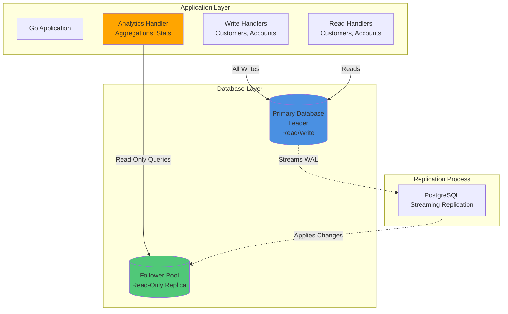

### Key Implementation Points

#### 1. **Database Initialization**

The application initializes two separate database connections:

```go
// Primary database (required)
PrimaryDB *sql.DB  // Connected via DATABASE_URL

// Analytics database (optional)
AnalyticsDB *sql.DB  // Connected via ANALYTICS_DB_URL
```

**Initialization Flow**:
1. `InitPrimaryDB()` - Always connects to primary database
2. `InitAnalyticsDB()` - Attempts to connect to follower pool
   - If `ANALYTICS_DB_URL` is set → Connects to follower pool
   - If not set → Falls back to `PrimaryDB` reference

#### 2. **Query Routing Logic**

The application routes queries based on operation type:

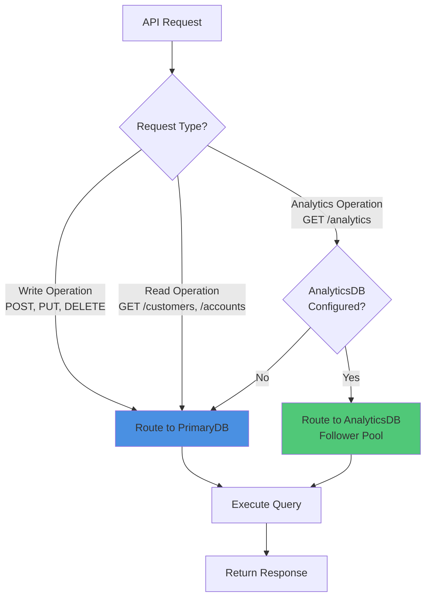

#### 3. **Code Implementation**

**Analytics Handler** (`internal/api/analytics_handler.go`):
```go
func GetAnalytics(c *gin.Context) {
    // Use analytics DB (follower pool) for read-only analytics queries
    analyticsDB := db.AnalyticsDB
    if analyticsDB == nil {
        analyticsDB = db.PrimaryDB  // Fallback to primary
    }
    
    // Execute read-only queries on follower pool
    analyticsDB.QueryRow("SELECT COUNT(*) FROM customers")
    // ...
}
```

**CRUD Handlers** (`internal/api/customer_handler.go`, `account_handler.go`):
```go
func CreateCustomer(c *gin.Context) {
    // All writes go to primary database
    db.PrimaryDB.Exec("INSERT INTO customers ...")
    // ...
}
```

### Replication Details

#### PostgreSQL Streaming Replication

Heroku Postgres Advanced uses PostgreSQL's native streaming replication:

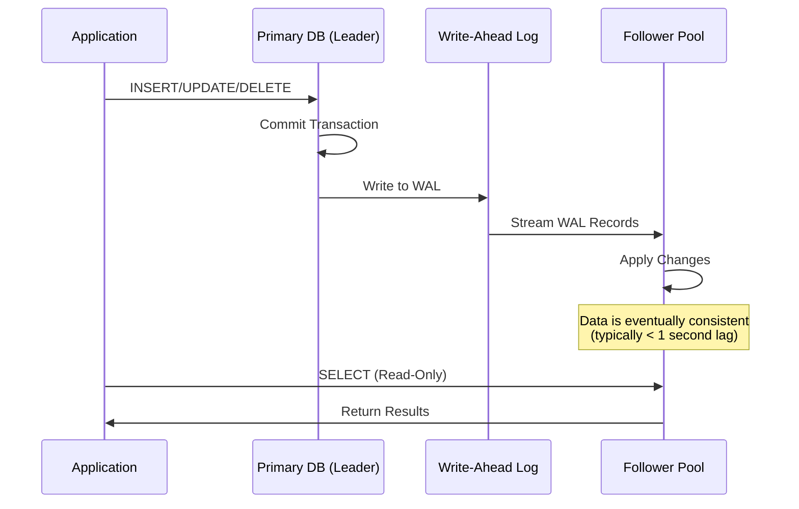

**Replication Characteristics**:
- **Type**: Asynchronous streaming replication
- **Lag**: Typically < 1 second (depends on network and load)
- **Consistency**: Eventually consistent (reads may see slightly stale data)
- **Failover**: Automatic promotion to leader if primary fails (Heroku managed)

---

## Data Flow

### Write Operations Flow

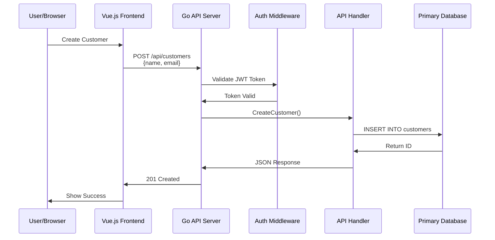

### Read Operations Flow (CRUD)

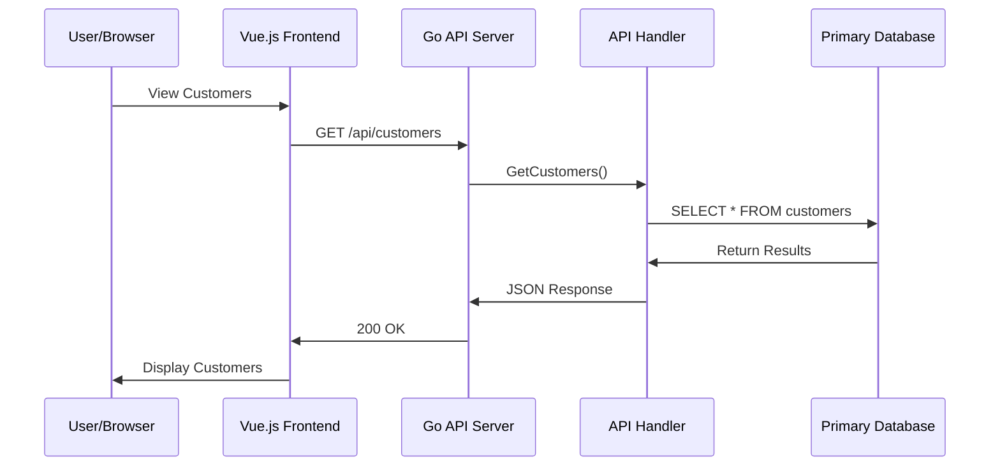

### Analytics Operations Flow (Follower Pool)

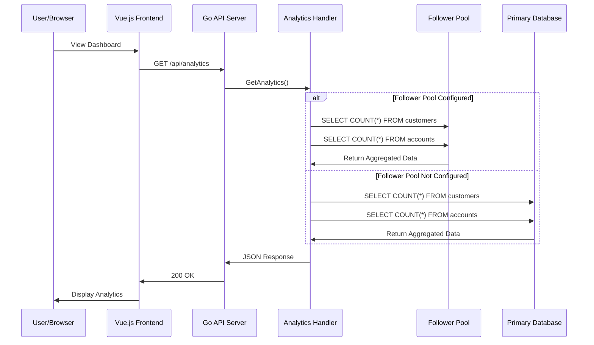

---

## Request Routing

### API Endpoint Classification

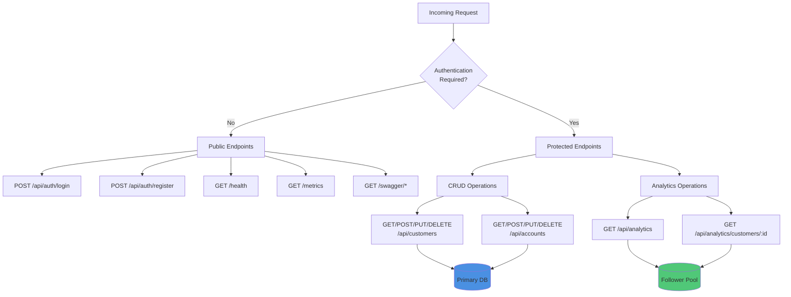

### Database Selection Matrix

| Endpoint | Method | Database | Reason |
|----------|--------|----------|--------|
| `/api/auth/login` | POST | Primary | Write operation (session tracking) |
| `/api/auth/register` | POST | Primary | Write operation (user creation) |
| `/api/customers` | GET | Primary | Read operation (transactional data) |
| `/api/customers` | POST | Primary | Write operation |
| `/api/customers/:id` | GET | Primary | Read operation (transactional data) |
| `/api/customers/:id` | PUT | Primary | Write operation |
| `/api/customers/:id` | DELETE | Primary | Write operation |
| `/api/accounts` | GET | Primary | Read operation (transactional data) |
| `/api/accounts` | POST | Primary | Write operation |
| `/api/accounts/:id` | GET | Primary | Read operation (transactional data) |
| `/api/accounts/:id` | PUT | Primary | Write operation |
| `/api/accounts/:id` | DELETE | Primary | Write operation |
| `/api/analytics` | GET | **Follower** | Read-only aggregation (can tolerate slight lag) |
| `/api/analytics/customers/:id` | GET | **Follower** | Read-only aggregation (can tolerate slight lag) |

**Key Decision Points**:
- **Transactional Reads** (customers, accounts) → Primary DB (need latest data)
- **Analytics Reads** (aggregations, counts) → Follower Pool (can tolerate replication lag)
- **All Writes** → Primary DB (only leader accepts writes)

---

## Database Connection Management

### Connection Initialization

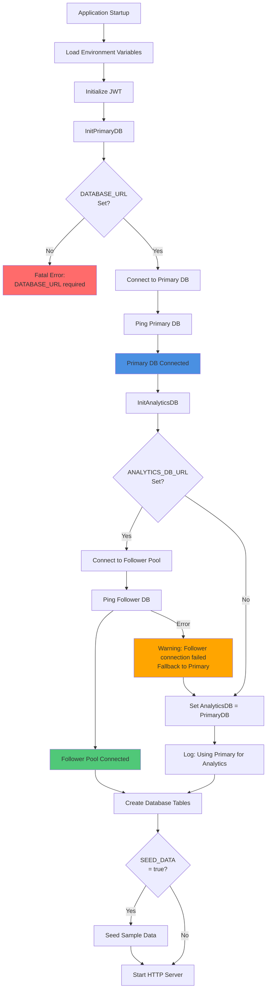

### Connection Pool Management

The application uses Go's `database/sql` package which provides built-in connection pooling:

- **Connection Pool**: Managed automatically by `sql.DB`
- **Max Open Connections**: Default (unlimited, but PostgreSQL has limits)
- **Max Idle Connections**: Default (2)
- **Connection Lifetime**: Managed by PostgreSQL server settings

**Best Practices**:
- Connections are reused across requests
- Idle connections are kept alive for quick reuse
- Connections are automatically closed when the application shuts down

---

## Background Jobs

### Architecture

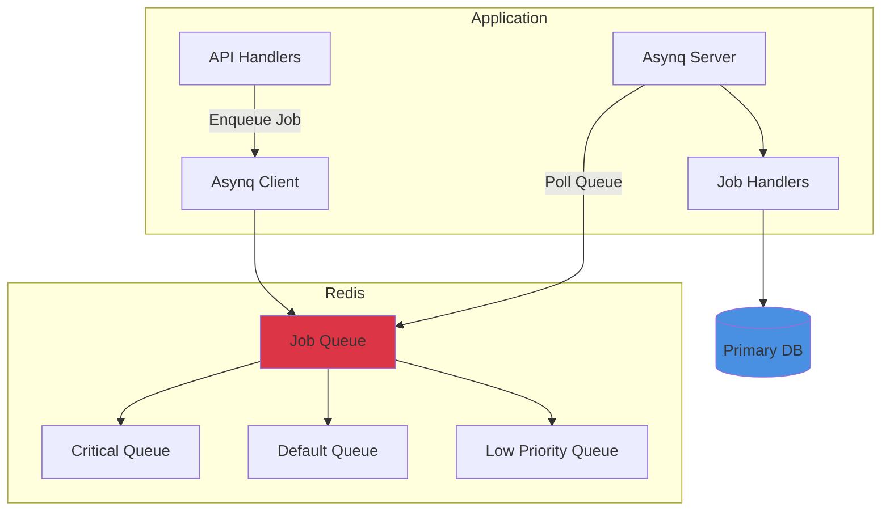

### Job Processing Flow

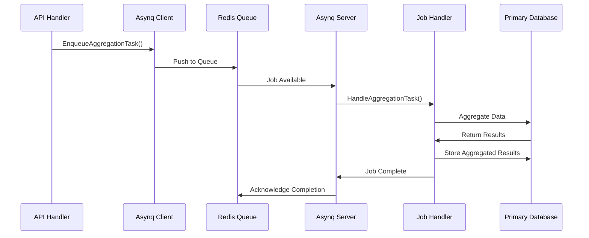

### Queue Priorities

The application uses three priority queues:

1. **Critical Queue** (Priority 6): High-priority tasks
2. **Default Queue** (Priority 3): Standard tasks
3. **Low Queue** (Priority 1): Background processing

**Configuration** (`main.go`):
```go
asynq.Config{
    Concurrency: 10,
    Queues: map[string]int{
        "critical": 6,
        "default":  3,
        "low":      1,
    },
}
```

---

## Authentication & Authorization

### JWT Authentication Flow

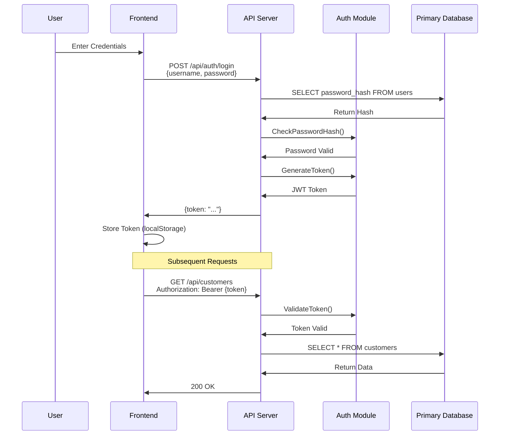

### Middleware Protection

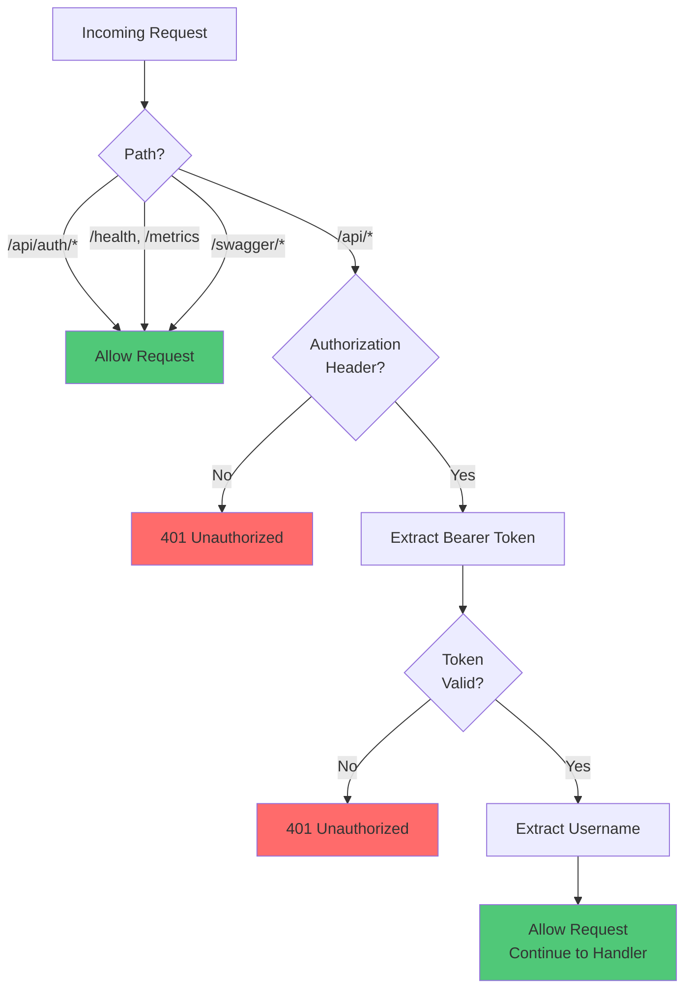

---

## Deployment Architecture

### Heroku Deployment

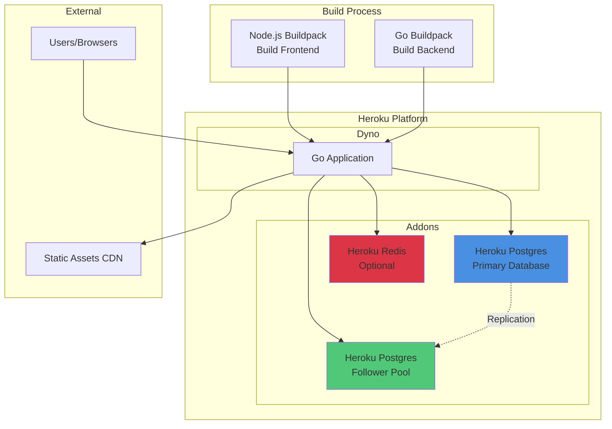

### Environment Configuration

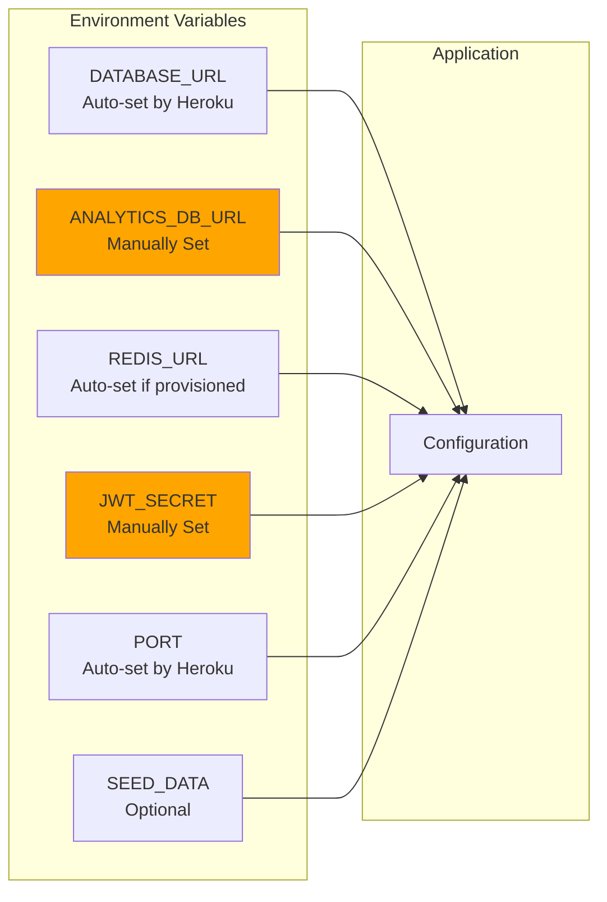

---

## Key Architectural Decisions

### 1. **Why Leader/Follower for Analytics?**

**Problem**: Analytics queries (COUNT, AVG, aggregations) can be resource-intensive and slow down transactional operations.

**Solution**: Route analytics queries to a read-only follower pool.

**Benefits**:
- Primary database remains responsive for transactional operations
- Analytics queries don't block writes
- Can scale analytics independently
- Follower pool can be optimized for read-heavy workloads

**Trade-offs**:
- Slight replication lag (typically < 1 second)
- Additional infrastructure cost
- More complex connection management

### 2. **Why Not Use Follower for All Reads?**

**Decision**: Only use follower pool for analytics, not for transactional reads.

**Reasoning**:
- Transactional reads (GET /api/customers/:id) need the latest data
- Users expect to see their changes immediately
- Analytics can tolerate slight lag (counts, averages)
- Simpler mental model: "writes and transactional reads → primary, analytics → follower"

### 3. **Graceful Degradation**

**Implementation**: If `ANALYTICS_DB_URL` is not set, analytics endpoints use the primary database.

**Benefits**:
- Application works without follower pool (development, small deployments)
- No code changes needed to enable/disable follower pool
- Easy to test locally with single database

### 4. **Connection Management**

**Decision**: Use separate connection pools for primary and follower.

**Benefits**:
- Independent connection limits
- Can tune each pool separately
- Clear separation of concerns
- Easy to monitor connection usage per database

---

## Monitoring & Observability

### Health Check Endpoint

The `/health` endpoint reports the status of both database connections:

```json
{
  "status": "healthy",
  "database": "connected",
  "analytics_db": "connected"  // or "using primary" if not configured
}
```

### Metrics Endpoint

The `/metrics` endpoint provides Prometheus-compatible metrics for:
- HTTP request counts
- Response times
- Error rates
- Database connection pool stats (if instrumented)

---

## Future Enhancements

### Potential Improvements

1. **Connection Pooling Configuration**
   - Make connection pool sizes configurable
   - Add metrics for connection pool usage

2. **Read Replicas for Transactional Reads**
   - Add option to route some transactional reads to follower
   - Implement read preference based on consistency requirements

3. **Caching Layer**
   - Add Redis caching for frequently accessed data
   - Cache analytics results with TTL

4. **Database Sharding**
   - Partition customers/accounts by region or ID range
   - Route queries to appropriate shard

5. **Event Sourcing**
   - Store events instead of current state
   - Rebuild analytics from event stream

---

## Conclusion

The SaaS Go App implements a clean separation between transactional operations and analytics queries through the leader/follower database pattern. This architecture provides:

- **Performance**: Optimized read and write operations
- **Scalability**: Can scale reads independently from writes
- **Reliability**: Graceful degradation if follower pool is unavailable
- **Simplicity**: Clear routing logic and easy to understand

The application is designed to work with or without a follower pool, making it suitable for both development and production environments.

